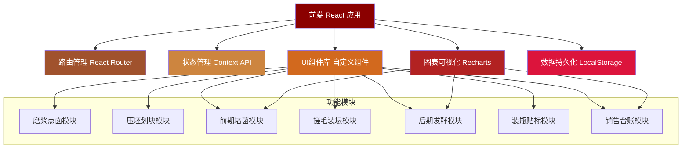
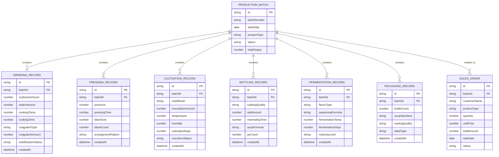

## 1. 架构设计



## 2. 技术描述

- **前端框架**：React@18 + TypeScript
- **构建工具**：Vite@5
- **样式方案**：TailwindCSS@3 + CSS变量主题系统
- **路由管理**：React Router DOM@6
- **图表可视化**：Recharts@2
- **图标库**：Lucide React
- **状态管理**：React Context API + useReducer
- **数据持久化**：LocalStorage（模拟数据存储）
- **日期处理**：date-fns
- **后端**：无后端，前端Mock数据模拟
- **数据库**：LocalStorage + JSON Mock数据

## 3. 路由定义

| 路由 | 页面名称 | 功能说明 |
|------|----------|----------|
| `/` | 首页仪表盘 | 生产概览、关键指标统计、温湿度监控 |
| `/grinding` | 磨浆点卤 | 黄豆磨浆煮浆记录、点卤凝固参数配置 |
| `/pressing` | 压坯划块 | 压榨成坯监控、白坯切块摆笼管理 |
| `/cultivation` | 前期培菌 | 毛霉接种培菌、温湿度实时监控 |
| `/bottling` | 搓毛装坛 | 搓毛腌坯、加料汤装坛记录 |
| `/fermentation` | 后期发酵 | 红方青方调味、后发酵成熟监控 |
| `/packaging` | 装瓶贴标 | 装瓶灌汤封口、标签管理 |
| `/sales` | 销售台账 | 销售订单、出库记录、财务统计 |

## 4. 数据模型

### 4.1 实体关系图



### 4.2 核心数据类型定义

```typescript
// 生产批次
interface ProductionBatch {
  id: string;
  batchNumber: string;
  startDate: string;
  productType: 'red' | 'green' | 'white';
  status: 'grinding' | 'pressing' | 'cultivation' | 'bottling' | 'fermentation' | 'packaging' | 'completed' | 'sold';
  totalOutput: number;
}

// 温湿度记录
interface TemperatureHumidity {
  timestamp: string;
  temperature: number;
  humidity: number;
}

// 磨浆点卤记录
interface GrindingRecord {
  id: string;
  batchId: string;
  soybeanAmount: number;
  waterAmount: number;
  cookingTemp: number;
  cookingTime: number;
  coagulantType: string;
  coagulantAmount: number;
  solidificationStatus: string;
  createdAt: string;
}

// 销售订单
interface SalesOrder {
  id: string;
  batchId: string;
  customerName: string;
  productType: string;
  quantity: number;
  unitPrice: number;
  totalAmount: number;
  saleDate: string;
  status: 'pending' | 'shipped' | 'completed';
}
```

## 5. 目录结构

```
src/
├── components/          # 公共组件
│   ├── Layout/         # 布局组件
│   ├── Dashboard/      # 仪表盘组件
│   ├── Charts/         # 图表组件
│   ├── Forms/          # 表单组件
│   └── ui/             # 基础UI组件
├── pages/              # 页面组件
│   ├── Dashboard.tsx
│   ├── Grinding.tsx
│   ├── Pressing.tsx
│   ├── Cultivation.tsx
│   ├── Bottling.tsx
│   ├── Fermentation.tsx
│   ├── Packaging.tsx
│   └── Sales.tsx
├── context/            # 状态管理
│   └── AppContext.tsx
├── data/               # Mock数据
│   └── mockData.ts
├── types/              # TypeScript类型定义
│   └── index.ts
├── utils/              # 工具函数
│   ├── date.ts
│   └── storage.ts
├── App.tsx
├── main.tsx
└── index.css
```

## 6. 核心功能实现说明

### 6.1 温湿度实时监控
- 使用Recharts绘制实时温湿度曲线图
- 模拟传感器数据，每5秒更新一次
- 设置阈值告警，超出范围时高亮显示

### 6.2 生产流程状态管理
- 使用Context API管理全局生产状态
- 每个模块更新时同步更新批次状态
- 流程进度条实时反映当前所处阶段

### 6.3 数据持久化
- 使用LocalStorage存储所有生产记录
- 页面刷新后数据不丢失
- 提供数据导出功能（JSON格式）

### 6.4 响应式适配
- 使用TailwindCSS响应式类
- 导航栏在移动端可折叠
- 表格在小屏幕转为卡片展示
